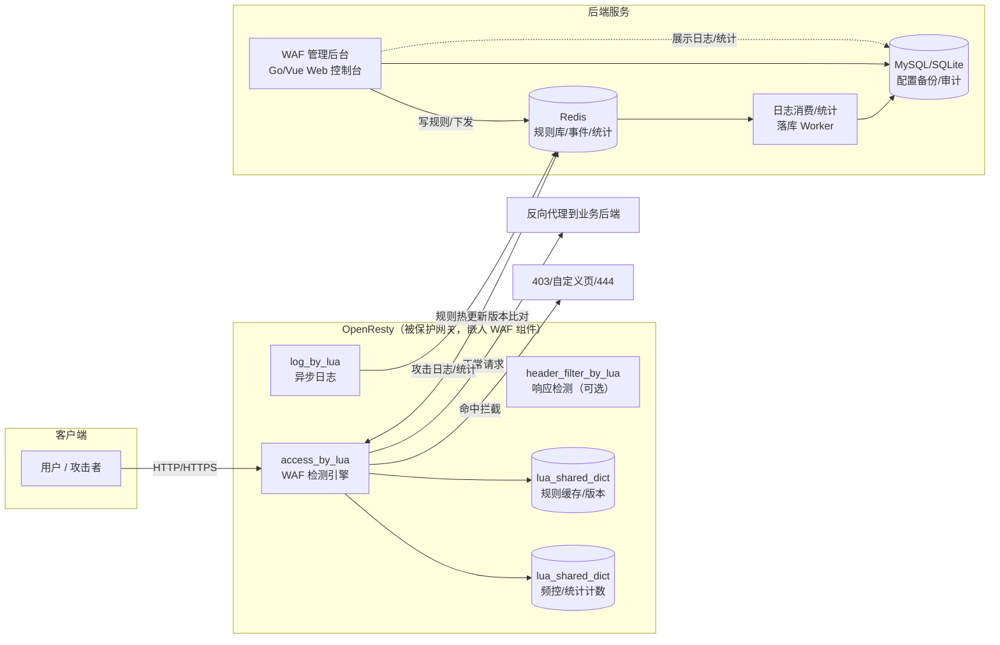
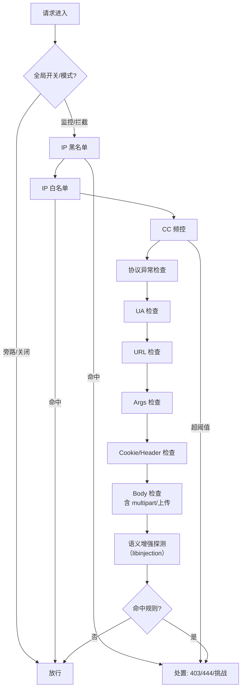
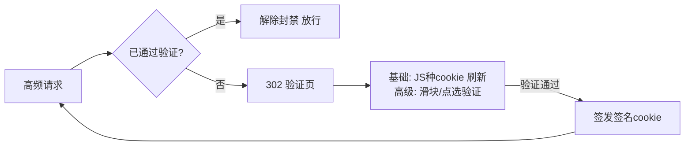

# OpenResty WAF

一个适配于任意 OpenResty 的 Web 应用防火墙：通过 Lua 规则接入，自动检测、拦截、阻断并记录流量；内置 Web 管理后台，支持可视化配置拦截规则与接入常见规则库（OWASP CRS 等）。

## 核心特性

- **嵌入式接入**：纯 Lua 组件，挂载到任意 OpenResty 的 `access_by_lua` / `header_filter_by_lua` / `log_by_lua` 阶段，无需重新编译 Nginx。
- **规则热更新**：规则经 Redis 下发，worker 内共享内存缓存 + 版本原子切换，配置变更不中断连接；版本单调校验 + 规则集结构校验（坏规则集拒载），发布历史快照支持一键回滚。
- **完整防护能力**：SQLi / XSS / RCE / LFI / SSRF / 协议异常 / 敏感文件泄露 / 恶意 UA 与扫描器 / 文件上传检测（含超大上传落盘流式检测）；多层编码解码（base64/hex/HTML 实体）抗绕过、HPP 参数污染、IPv6 CIDR、API 安全（敏感端点/GraphQL 内省/XXE）、DLP 响应体敏感数据防泄露。
- **访问控制与限流**：IP / UA / Cookie / Header / URL / Args 黑白名单、CC 防刷（支持 UA/无 Cookie 维度计数）、人机验证（JS 工作量证明，无 JS 的 bot 无法通过）。
- **Bot 管理**：爬虫/客户端指纹规则组（搜索引擎爬虫/客户端库/监控探针），配合触发规则 豁免/挑战/限流/直接拦截 四级策略；JA4/JA4H TLS 与 HTTP 指纹。
- **自动封禁与处置**：攻击事件一键封禁（临时/永久，时效条目 ip|unix_ts 到期自动解封；支持 IP+UA 维度）、封禁管理页、同 IP 高频攻击自动临时封禁（阈值/窗口/时长可配，白名单豁免）。
- **事件处置闭环**：事件标记误报（计入规则命中率统计）、一键豁免（生成 host+路径豁免规则）、一键封禁、事件/流量 CSV 导出。
- **运维可观测**：引擎心跳在线状态与规则同步状态、实时 QPS 监控（秒级曲线）、告警通知（Webhook/钉钉/企业微信/飞书/邮件，事件风暴/引擎离线，可联动自动回滚最近规则发布）、操作审计日志（谁在何时改了什么）。
- **面板安全加固**：访问 IP 白名单（`ADMIN_ALLOWED_IPS`）、CSRF 双提交校验、安全响应头、登录会话管理与强制下线、Redis 密码不回显。
- **隐私合规**：攻击证据入库前敏感信息脱敏（密码/令牌字段与手机号/身份证等正则打码，字段与正则后台可配）。
- **品牌化**：挑战页标题/公司/联系方式可配置；响应安全头（HSTS/CSP 等）自动加固，移除 Server/X-Powered-By 等泄露头。
- **灵活工作模式**：监控（仅记录）/ 拦截 / 放行，可全局一键切换；检测异常 fail-open，检测耗时 watchdog 超阈值强制放行。
- **Web 管理后台**：仪表盘、规则管理（含在线调试、导入导出、发布历史与回滚、灰度发布、订阅源同步）、事件检索与一键封禁、封禁管理、站点管理、账号安全（TOTP 双因子 + 登录防爆破）、RBAC 多角色（超管/运营/只读）+ 用户管理 + API Token、版本健康信息。
- **平台化 API**：`/api` 与 `/api/v1` 双前缀兼容；运行时自动生成 OpenAPI 3.0 规范（`/api/openapi.json`）与中文接口文档页（`/api/docs`）；API Token 非交互认证供脚本/CI 调用。

## 架构总览



**规则热更新数据流（无需 reload）：**

1. 管理后台写入/修改规则 → Redis（JSON ruleset + 全局 `version` 自增）。
2. 各 worker 内共享内存缓存规则；每次请求比对版本号，变化则原子切换加载新规则集。
3. `access_by_lua` 阶段执行检测，命中按动作处置。
4. `log_by_lua` 阶段异步写攻击日志与统计计数（不阻塞请求）。
5. 后台从 Redis/落库数据读取展示，支持事件"一键加黑/加白"（写回规则库立即生效）。

## 目录结构

```
openresty-waf/
├── waf/                     # Lua WAF 引擎（OpenResty 侧）
│   ├── init.lua             #   初始化入口
│   ├── access.lua           #   access_by_lua 检测入口
│   ├── log.lua              #   log_by_lua 日志入口
│   ├── rule_engine/         #   规则引擎（运算符/变量/变换/动作）
│   ├── detectors/           #   检测器（cc/challenge/upload/auto_ban/bot）
│   └── ruleset/             #   内置规则集（JSON）
├── admin/                   # 管理后台（Go + Gin + GORM）
├── web/                     # 管理前端（Vue3 + Vite + Soybean Admin）
└── deploy/                  # Docker 部署编排与压测配置
```

## 技术栈

| 端 | 技术 |
|---|---|
| WAF 引擎 | OpenResty + LuaJIT（纯 Lua，lua-resty-core / lua-resty-lock / lua-resty-redis） |
| 管理后台 | Go + Gin + GORM + MySQL/SQLite + Redis |
| 管理前端 | Vue3 + Vite + TypeScript + Naive UI（Soybean Admin）+ Pinia + ECharts |

## 快速开始

### 管理后台（单容器一键启动）

```bash
docker compose up -d --build
```

浏览器打开 http://\<host\>:8232（默认账号 `admin / admin123`，可用 `ADMIN_INIT_PASSWORD` 覆盖；
端口由 compose 中 `ADMIN_ADDR` 控制），
首次使用会进入**引导页**：

1. **配置 Redis**：填写你已有 Redis 实例的连接信息（规则热下发 / 攻击事件队列），后台先做连通性测试。
2. **接入本机 OpenResty**：在运行 OpenResty 的服务器上执行引导页给出的一键命令，
   自动下载 WAF Lua 组件、生成 `config_local.lua`（Redis 连接）与 `nginx.conf` 接入片段，
   挂载 `init/access/log` 三个阶段即可生效。

```
┌─────────────┐     引导接入      ┌──────────────────────────────┐
│ 单容器管理后台 │ ───────────────► │ 本机已部署的 OpenResty          │
│ (Go+Vue,8232) │   下载组件/脚本    │  + /opt/waf (Lua 组件)        │
└──────┬──────┘                   │  + nginx.conf 挂载            │
       │ 规则下发/事件消费          │                                │
       ▼                          └──────────────┬───────────────┘
  你已有的 Redis ◄───────────────────────────────┘ 事件上报/规则热更
```

### 使用 GHCR 镜像

main 分支 / `v*` 标签 push 后，GitHub Actions 自动构建并推送到
`ghcr.io/<owner>/openresty-waf`（多架构：linux/amd64 + linux/arm64，按宿主机架构自动拉取对应镜像）：

```bash
docker pull ghcr.io/<owner>/openresty-waf:latest
docker run -d --name waf-admin --network host -e ADMIN_ADDR=:8232 \
  -v waf-data:/data \
  -e ADMIN_INIT_PASSWORD=your-password \
  -e ADMIN_JWT_SECRET=your-secret \
  ghcr.io/<owner>/openresty-waf:latest
```

### 手动部署

**1. 管理后台**：`cd admin && go build -o waf-admin . && ./waf-admin`，打开引导页完成配置。

**2. WAF 引擎（接入本机任意 OpenResty）**：引导页下载组件到 `/opt/waf`，在 `nginx.conf` 挂载：

```nginx
lua_package_path "/opt/waf/?.lua;;";
lua_shared_dict waf_rule    20m;
lua_shared_dict waf_counter 50m;
init_by_lua_file         /opt/waf/init.lua;
init_worker_by_lua_file  /opt/waf/init.lua;   # Redis 规则热更新
access_by_lua_file       /opt/waf/access.lua;
log_by_lua_file          /opt/waf/log.lua;
# 可选（响应检测：状态码/响应体拦截与泄露监控）
header_filter_by_lua_file /opt/waf/header_filter.lua;
body_filter_by_lua_file   /opt/waf/body_filter.lua;
```

**3. 管理前端（开发模式）**：`cd web && pnpm install && pnpm dev`

## WAF 引擎详解

纯 Lua 实现（LuaJIT 5.1 语法），挂载到任意 OpenResty 即可生效。

### 引擎目录结构

```
waf/
├── init.lua              # 初始化入口（加载配置/规则/共享内存）
├── access.lua            # access_by_lua 检测编排入口
├── header_filter.lua     # header_filter_by_lua 响应检测（状态码拦截）
├── body_filter.lua       # body_filter_by_lua 响应体检测与拦截页替换
├── log.lua               # log_by_lua 异步日志/统计入口
├── config.lua            # 全局配置（模式、阈值、路径、依赖开关）
├── storage.lua           # 共享内存 + Redis 读写封装
├── ip_region.lua         # ip2region xdb 归属地查询（可选）
├── ja4.lua / ja4h.lua    # JA4 TLS 指纹 / JA4H HTTP 指纹
├── fingerprint.lua       # 客户端指纹聚合
├── libinjection_ffi.lua  # libinjection 语义检测 FFI 绑定（可选）
├── rule_engine/          # 规则引擎
│   ├── engine.lua        #   规则执行器（phase 过滤/仲裁/异常打分）
│   ├── operators.lua     #   运算符：REGEX/PM/EQUALS/CONTAINS/CIDR...
│   ├── variables.lua     #   变量：URI_ARGS/POST_ARGS/HEADERS/BODY/RESPONSE_*
│   ├── transforms.lua    #   变换链：url_decode/lowercase/去注释/空白压缩
│   ├── actions.lua       #   动作：BLOCK/DROP/ACCEPT/REDIRECT/SCORE/LOG_ONLY
│   ├── trigger.lua       #   触发规则（CC/人机验证/豁免/拦截）
│   └── util.lua          #   JSON 结构化/静态路径剪枝工具
├── detectors/            # 检测器
│   ├── cc.lua            #   CC 频控（shared dict 计数 + 封禁）
│   ├── challenge.lua     #   人机验证（basic/geetest/gitee）
│   ├── upload.lua        #   文件上传检测（后缀/Content-Type 黑名单）
│   ├── auto_ban.lua      #   高频攻击自动封禁
│   └── bot.lua           #   Bot 管理
├── libinjection/         # libinjection C 源码（scripts/build-libinjection.sh 编译）
└── t/                    # 单元测试（mock + run.lua，纯 luajit 可跑）
```

### IP 归属地（可选）

引擎内置纯 Lua 的 ip2region xdb 解析器（`ip_region.lua`，兼容 v2/v3 格式），
命中攻击日志会附带 country / province / city 归属地，后台可展示地理分布。

- 数据文件：将 `ip2region_v4.xdb` 放入 **`/opt/waf/`**（与 WAF 配置同目录，经 bind mount 下发）
- 缺省路径：`/opt/waf/ip2region_v4.xdb`（引擎容器重建无需重新放置）
- 缺失时自动降级：攻击日志不带归属地，不影响防护功能

### 规则集来源与热更新

规则完全由管理后台经 Redis 下发（`waf:rule:ruleset` + `waf:rule:version`），
引擎启动时不加载任何内置规则。Redis 规则集为空（后台未发布 / 加载失败）时，
access 阶段按 **fail-closed** 策略拦截全部流量，防止"无规则裸奔"。

- 规则热更新：引擎每 5s 轮询版本号，变化时原子切换（先写规则集后写版本号）
- 回滚保护：Redis 规则集结构非法时拒绝加载，保持当前生效规则集
- 后台重种：`SeedVersion` 变更后重启 admin 会删除 `is_seed` 规则并重新插入

### 规则 DSL（JSON）

```json
{
  "id": "20001",
  "group": "sqli",
  "phase": "access",
  "severity": 2,
  "enabled": true,
  "vars":   [{ "type": "URI_ARGS", "parse": ["values", true] }],
  "operator": "REGEX",
  "pattern": "(union[\\s]+select|select[\\s]+.*from)",
  "transforms": ["url_decode", "to_lowercase"],
  "actions": { "disrupt": "BLOCK", "status": 403,
               "msg": "SQL injection detected", "tag": "attack-sqli" }
}
```

- **phase**：`access`（请求检测）/ `header_filter`（响应头）/ `body_filter`（响应体，可选）。
- **变量**：`URI_ARGS`、`POST_ARGS`、`HEADERS`、`COOKIE`、`BODY`、`METHOD`、`REQUEST_LINE` 等，支持 `specific` 参数与负向排除。
- **运算符**：`REGEX`（PCRE JIT）、`PM`（词组）、`EQUALS`、`CONTAINS`、`CIDR`、`STRREQ`、`EXISTS`。
- **变换链**：`url_decode` → `to_lowercase` → 多重解码，模拟真实解码场景。
- **高级特性**：规则链（`chain`）、规则跳转（`skip`）、规则例外（白名单规则）、异常打分（`SCORE` + 阈值）。

### 检测流水线（access 阶段）



- 每一步都支持"仅记录"（监控模式），命中即写攻击日志。
- 白名单优先于黑名单与规则检测，避免误伤。

### 设计约定

- 纯 Lua 5.1（LuaJIT）语法，不依赖 C 模块（libinjection 经 FFI 可选增强）。
- 依赖的第三方库均为纯 Lua 的 `lua-resty-*` 系列。
- 所有模块通过 `require` 加载，模块返回 table。

## 人机验证（Challenge）

WAF 在 **CC 超限** 且请求**未通过验证**时，返回验证页（302 跳转）而非直接拦截，
通过验证后自动解除封禁放行。

### 工作模式（`config.lua` → `_M.challenge.mode`）

| mode | 说明 | 依赖 |
|---|---|---|
| `basic` | 基础 JS Challenge：服务端签名 token，前端执行 JS 种 cookie 后自动刷新 | 无（自包含，默认） |
| `geetest` | 极验验证码（GT4 四代） | 需极验账号（captcha_id/key） |
| `gitee` | Gitee 验证码（与极验 GT4 协议兼容） | 需 Gitee 验证码服务账号 |

### 配置示例

```lua
_M.challenge = {
    enabled       = true,
    mode          = "basic",   -- basic | geetest | gitee
    cookie_name   = "waf_pass",
    cookie_secret = "请修改为随机长字符串",  -- 生产环境务必修改
    cookie_ttl    = 300,       -- 通过验证后的放行时长（秒）
    page_path     = "/__waf_challenge__",
    verify_path   = "/__waf_challenge_verify__",
    captcha = {
        id         = "",       -- 极验/Gitee captcha_id
        key        = "",       -- captcha_key
        verify_api = "https://gcaptcha4.geetest.com/validate",
        sdk        = "https://static.geetest.com/v4/gt4.js",
    },
},
```

### 接入 Gitee / 极验验证码（高级模式）

1. 在 Gitee 验证码 / 极验开放平台创建应用，获取 `captcha_id` 与 `captcha_key`。
2. 修改 `config.lua`：
   - `mode = "gitee"`（或 `"geetest"`）
   - 填入 `captcha.id`、`captcha.key`
   - 若使用 Gitee 独立接入点，将 `verify_api` 指向 Gitee 提供的验证接口
3. 校验协议（GT4 兼容）：
   - 前端完成验证后回传 `lot_number / captcha_output / pass_token / gen_time`
   - WAF 以 `sign_token = md5(captcha_key + lot_number)` 调 `verify_api`
   - 返回 `result == "success"` 则签发放行 cookie
4. **HTTP 客户端依赖**：
   - 验证接口为 HTTPS 时需安装 `lua-resty-http`（`opm get ledgetech/lua-resty-http`）
   - 未安装时自动回退到手动 cosocket，**仅支持 http:// 明文**接口

### 验证流程



- **basic 模式**：token 由服务端签名，不暴露密钥；无 JS 能力的 Bot 无法种 cookie，无法通过。
- **cookie 校验**：签名 + 有效期双重校验，防伪造与重放（过期即失效）。

### 测试（basic 模式）

```bash
# 触发 CC（临时把 config.lua 的 cc.rate 调低，如 "5/60"）
for i in 1 2 3 4 5; do curl -s -o /dev/null http://HOST:8086/?x=$i; done
# 第 5 次应 302 到挑战页
curl -s -o /dev/null -w "%{http_code} %{redirect_url}\n" http://HOST:8086/?x=6
# 挑战页返回含签名 cookie 的 HTML
curl -s http://HOST:8086/__waf_challenge__ | grep "document.cookie"
# 带正确签名 cookie（用 cookie_secret + 客户端 IP + 时间戳计算）→ 放行
```

## 慢速攻击与连接层加固

慢速攻击（Slowloris、慢 body、RUDY）在 WAF 引擎层无法完全拦截——
请求头/请求体是 nginx 在进入 Lua 阶段前接收的。本项目采用「引擎规则 + nginx 配置」双层防护。

### 一、nginx 层（推荐必配）

在 `nginx.conf` 的 `http {}` 段加入：

```nginx
# slowloris：请求头读超时（10s 内未读完一个请求头即断开）
client_header_timeout   10s;
# 慢 body / RUDY：两次读 body 之间的超时
client_body_timeout     30s;
# 请求体缓冲上限：超过则落临时文件
# （WAF 上传检测仍会扫描落盘文件前 512KB，见 config.lua upload.spooled_scan_bytes）
client_body_buffer_size 128k;
# 响应发送超时
send_timeout            30s;
```

- `client_header_timeout` 默认 60s，攻击者每 50s 发 1 字节即可长期占满 worker 连接，
  建议收紧到 5~10s。
- `client_body_timeout` 默认 60s，是 RUDY（慢 body）攻击的生存窗口。
- `client_body_buffer_size` 与内存占用正相关，业务有大表单可按需上调；
  超过该值的 body 会落盘，WAF 的上传检测会流式读取临时文件前
  `spooled_scan_bytes`（默认 512KB）字节继续做后缀/类型检测，不再整体跳过。
- 静态资源站点可在 `location` 内加 `limit_rate 512k;` 防慢读（慢下载拖垮带宽）。

### 二、引擎层（内置规则，默认开启）

内置规则集协议异常组：

| 规则 ID | 说明 | 动作 |
|---|---|---|
| 25007 | 请求头数量 ≥100（`HEADERS_COUNT` 变量） | BLOCK 400 |
| 25008 | 请求参数总量 ≥100（`ARGS_COUNT` 变量） | BLOCK 400 |
| 25001-25006 | 非标准方法 / URI 过长 / 方法非法字符 / 异常 Content-Length / 控制字符 | BLOCK |

参数/请求头洪泛属于应用层 DoS，由以上计数规则与 CC 防刷共同覆盖。

### 三、验证

```bash
# 1) 慢请求头：20s 内只发一个字节
(printf 'G'; sleep 20) | timeout 30 nc <host> <port>

# 2) 慢 body：Content-Length 声明大 body 后缓慢发送
printf 'POST / HTTP/1.1\r\nHost: x\r\nContent-Length: 100000\r\n\r\n' | timeout 60 nc <host> <port>

# 3) 超大上传绕过验证：body 超过 client_body_buffer_size 的上传仍应命中
#    危险后缀拦截（事件列表应出现"文件上传：危险后缀"）
```

## 部署测试

### 冒烟测试（Docker）

前置：本机安装 Docker。

```bash
# 1. 启动带 WAF 的 OpenResty 测试实例
docker run -d --rm --name waf-test \
  -p 8080:8080 \
  -v "$PWD/waf":/waf \
  -v "$PWD/deploy/nginx-test.conf":/usr/local/openresty/nginx/conf/nginx.conf \
  openresty/openresty:alpine

# 2. 准备日志目录
docker exec waf-test mkdir -p /var/log/waf

# 3. 验证
# 正常请求 -> 200
curl -s -o /dev/null -w "%{http_code}\n" http://127.0.0.1:8080/
# 敏感文件泄露规则 -> 403
curl -s -o /dev/null -w "%{http_code}\n" http://127.0.0.1:8080/test.php.bak
# 扫描器 UA 规则 -> 403
curl -s -o /dev/null -w "%{http_code}\n" -A "sqlmap/1.0" http://127.0.0.1:8080/

# 4. 查看攻击日志
docker exec waf-test sh -c 'cat /var/log/waf/*.log'

# 5. 清理
docker rm -f waf-test
```

### 规则热更新端到端测试

验证"管理后台配置规则 → Redis 下发 → OpenResty 引擎热更新生效（无需 reload）"闭环。

前置：宿主运行 Redis（127.0.0.1:6379）与 WAF 管理后台。

```bash
# 1. 启动启用热更新的 OpenResty（--network=host 使容器直连宿主 Redis）
docker run -d --rm --name waf-hotreload --network=host \
  -v "$PWD/waf":/waf \
  -v "$PWD/deploy/nginx-hotreload.conf":/usr/local/openresty/nginx/conf/nginx.conf \
  openresty/openresty:alpine

# 2. 通过管理后台发布规则（需先登录获取 token）
TOKEN=$(curl -s -X POST http://127.0.0.1:8232/api/auth/login \
  -H "Content-Type: application/json" \
  -d '{"username":"admin","password":"admin123"}' | jq -r .token)

# 3. 等待引擎轮询（默认 5s），用非本机 IP 验证（127.0.0.1 默认在白名单内放行）
HOST_IP=$(hostname -I | awk '{print $1}')
curl -s -o /dev/null -w "%{http_code}\n" "http://$HOST_IP:8080/test.php.bak"  # 403
curl -s -o /dev/null -w "%{http_code}\n" "http://$HOST_IP:8080/?id=1%20union%20select%201"  # 403
```

## 性能基准

加 WAF 前后性能影响对比。最新测试日期：2026-08-14（版本化缓存 + 静态剪枝落地后）。

### 测试环境

| 项 | 值 |
|---|---|
| CPU | 16 核 |
| 内存 | 46 GB |
| OpenResty | 1.31.1.1（Docker，host 网络） |
| 压测工具 | ab（ApacheBench），`-n 50000 -c 100 -k`（keep-alive） |
| 访问地址 | 宿主 IP 非本机回环（避免命中默认白名单 127.0.0.1） |

### 测试方法

三组场景串行压测（避免资源争抢），同一 OpenResty 镜像：

| 场景 | 配置 | 说明 |
|---|---|---|
| 基准（无 WAF） | `deploy/nginx-bench-base.conf` | 纯 `content_by_lua` 返回，无检测 |
| 加 WAF（普通请求） | `deploy/nginx-bench-waf.conf` | 完整检测链路，请求 `/?id=1` 放行 |
| 加 WAF（攻击请求） | `deploy/nginx-bench-waf.conf` | 请求 `/?id=1%20union%20select%201` 命中拦截 + 日志写盘 |

> 说明：
> - 压测时无后台触发规则（未发布 CC 规则），CC 不会误伤压测；CC 正确性已单独验证。
> - **攻击 payload 必须 URL 编码**：原始空格会触发 nginx 请求行解析的慢路径，吞吐
>   降至约 1/7（实测无 WAF 的裸 nginx 同样如此，与 WAF 无关），会严重污染数据。
> - 基准配置未挂载 `header_filter/body_filter` 响应检测（可选挂载），
>   响应检测开销约为响应体累积 8KB 截断 + EOF 一次规则扫描，实际生产请自行评估。

### 测试结果（2026-08-14，优化后）

| 场景 | RPS | 相对基准 |
|---|---|---|
| 基准（无 WAF） | **181,148** | 100% |
| 加 WAF（普通请求） | **169,169** | **-6.6%** |
| 加 WAF（攻击请求，403 拦截 + 日志） | **148,613** | **-18.0%** |

- 普通请求：5 万请求全部 200（Failed 0）。
- 攻击请求：5 万请求全部 403 拦截（Non-2xx 50000），命中日志完整写入。

### 历史数据与优化历程

| 版本 | 普通请求相对基准 | 攻击请求相对基准 | 关键优化 |
|---|---|---|---|
| 2026-08-10 初版 | -47.7% | -65.7% | 无 |
| 2026-08-10 优化 | -39.9% | - | 请求级变量提取缓存 |
| **2026-08-14 优化** | **-6.6%** | **-18.0%** | 见下方「已落地优化」 |

已落地优化（2026-08-14）：

- **规则集/生效配置/触发规则集版本化缓存**：原实现每个请求对整份 JSON 规则集
  （后台 CRS 规则数百条）执行 `cjson.decode`，且触发规则集在 access 阶段最多被
  解码 3 次。改为按共享内存版本号（`ruleset_version` / `config_version` /
  `trigger_rules_version`）缓存解码结果，版本未变化时直接复用，热更新链路不变。
- **静态资源剪枝**：图片/字体/JS/CSS 等静态后缀（`config.detection.skip_static`）
  跳过规则引擎检测，名单/CC/人机验证仍生效。
- **拦截动作复用配置缓存**：BLOCK 动作渲染拦截页时不再重复解码配置 JSON，
  复用引擎的版本化配置缓存。

方法论修正：

- 攻击 payload 改为 URL 编码（`%20`）：原始空格请求在 nginx 请求行解析层即被
  拖慢约 7 倍（用无 WAF 的最小 403 对照组验证，与 WAF 代码无关）。
- 实测日志 file 后端（`io.open` 追加写）在该环境（OS 页缓存）下对吞吐影响
  可忽略；高并发生产环境仍建议切换 `redis` 后端异步上报。

### 分析

1. **普通请求开销**：加 WAF 后吞吐仅下降约 6.6%，主要来自规则引擎对
   URI_ARGS/HEADERS/BODY 的变量提取与规则 REGEX 匹配。
   单请求检测耗时约 0.08–0.1ms（base 0.55ms → WAF 0.59ms），优于
   lua-resty-waf 宣称的全规则集 300–500µs。
2. **拦截 + 日志开销**：攻击场景额外下降约 11 个百分点，来自 403 响应构造、
   事件组装与日志写盘；命中即返回，不进入内容阶段。
3. **CC 防刷副作用验证**：未发布触发规则时压测不受 CC 影响；发布 CC 规则后
   单 IP 高频请求会被正确判定封禁（返回 503）。

### 复现

```bash
# 基准
cd <repo>
docker run -d --rm --name bench-base --network=host \
  -v "$PWD/deploy/nginx-bench-base.conf":/usr/local/openresty/nginx/conf/nginx.conf \
  openresty/openresty:alpine
ab -n 50000 -c 100 -k "http://<HOST_IP>:8082/?id=1"

# 加 WAF
docker run -d --rm --name bench-waf --network=host \
  -v "$PWD/waf":/waf \
  -v "$PWD/deploy/nginx-bench-waf.conf":/usr/local/openresty/nginx/conf/nginx.conf \
  openresty/openresty:alpine
# 普通请求
ab -n 50000 -c 100 -k "http://<HOST_IP>:8083/?id=1"
# 攻击请求（payload 必须 URL 编码，见上文方法论说明）
ab -n 50000 -c 100 -k "http://<HOST_IP>:8083/?id=1%20union%20select%201"
```

## 项目背景与同类产品调研

### 同类产品一览

| 项目 | Star(约) | 技术架构 | Web 后台 | 规则形式 | 维护状态 | 与本项目关系 |
|---|---|---|---|---|---|---|
| 长亭 **雷池 SafeLine** | ~19.8k | Nginx + 语义分析引擎(Go/Rust) | 有(控制台**未开源**) | 语义引擎+插件，无规则库 | **活跃** | 社区事实标准，但是"独立反向代理设备"，不可嵌入自有 OpenResty |
| **VeryNginx** | ~5.9k | OpenResty + Lua | **有**(Vue 控制台) | Matcher+Action 规则 | 停滞(~2016) | **形态最接近**：控制台+WAF+频控+浏览器验证+统计；规则库多年不更新 |
| **ngx_lua_waf** | ~5.9k | OpenResty + Lua | 无 | 纯文本正则规则文件 | 停滞(多年未更新) | 经典轻量，接入方式与 CC 防护可借鉴；无后台、规则靠 crontab 更新 |
| **lua-resty-waf** | ~0.9k | OpenResty + Lua | 无 | JSON ruleset(模拟 ModSecurity CRS) | 停滞(~2018) | 引擎设计优秀：phase 模型、规则跳转/链、异常打分、CRS 转换器，**可借鉴** |
| **openstar** | ~1.9k | OpenResty + Lua | 有 | 规则组(支持 or 连接符) | 停滞 | 增强型 WAF，带管理界面 |
| **x-waf** | ~1k | OpenResty + Lua + Go 后台 | 有 | 后台配置下发 | 停滞 | 面向中小企业，后台二进制部署 |
| **锦衣盾 JXWAF** | ~0.97k | OpenResty + Lua + 机器学习/语义 | 有 | 语义+规则 | 缓慢(转商业 AI WAF) | 商业化了 |
| **NAXSI** | ~5k | Nginx C 模块 | 无 | 白名单式规则 | 缓慢 | 仅 SQLi/XSS(libinjection)，无控制台 |
| **ModSecurity + OWASP CRS** | ~9.7k / ~3.2k | C 模块 | 无 | SecRules | **活跃** | 行业标准、规则库最全；非 Lua、接入成本高，可作**规则导入源** |
| **Coraza** | ~2.5k | Go | 无 | ModSecurity 兼容 | 活跃 | 非 OpenResty 生态 |

### 结论与差异化空间

1. **市场空白点**：OpenResty+Lua 生态中，"**活跃维护 + 规则热更新 + 自带 Web 管理后台 + 可嵌入任意 OpenResty**"的产品组合**不存在**。带后台的(VeryNginx/openstar/x-waf)全部年久失修；活跃的(雷池)是独立部署的一体化设备且控制台闭源，无法嵌入已有 OpenResty 网关。
2. **可借鉴的经验**：
   - `ngx_lua_waf`：`access_by_lua` 接入方式、规则文件组织、基于 `lua_shared_dict` 的 CC 防护。
   - `lua-resty-waf`：phase(access/header_filter/body_filter/log) 模型、规则 offset 预计算与链、异常打分、CRS 转换工具。
   - `VeryNginx`：控制台交互模型(Matcher+Action)、频控、浏览器验证、访问统计、config.json 动态生效。
   - `雷池`：容器化部署、站点管理、事件检索/一键处置、告警等后台产品化经验。

### 项目定位

- **形态**：嵌入式 Lua 组件（挂载到任意 OpenResty）+ 独立 Web 管理后台 + 规则热下发通道。
- **核心能力**：自动检测 → 拦截/放行/人机验证 → 全量记录；后台可视化管理规则。
- **目标用户**：中小团队、独立开发者、已有 OpenResty 网关/API 网关想低成本叠加安全能力的团队。
- **一句话**：*"给任意 OpenResty 装上带后台的 WAF"*。

### 非功能性设计目标

- **性能**：全规则检测单请求延迟目标 < 1ms（实测 0.08–0.1ms，见性能基准章节）。
- **可用性**：检测异常时 **fail-open**（放行并记录，绝不影响业务）；全局旁路开关。
- **可移植性**：仅依赖 LuaJIT 2.1 标准库 + 常见纯 Lua `lua-resty-*` 库，无需重新编译 Nginx，适配 OpenResty ≥ 1.15。
- **安全**：管理后台独立端口/独立 server，限 IP 访问，强认证 + TOTP + 防爆破 + 敏感操作审计。

## 里程碑与决策记录

### 里程碑（M0–M5 已全部完成）

| 阶段 | 内容 |
|---|---|
| **M0 调研与原型** | 验证 Lua 引擎在各阶段挂载、Redis 规则热更链路可行性 |
| **M1 核心引擎** | 规则 DSL、运算符/变量/变换、内置规则集、监控/拦截模式、攻击日志 |
| **M2 进阶防护** | CC 频控、人机验证、multipart/上传检测、响应阶段检测、异常打分 |
| **M3 管理后台** | 仪表盘、规则管理（含在线调试、导入导出）、名单管理、日志查询、站点管理、认证(TOTP) |
| **M4 工程化** | 规则热更新一致性、性能压测与调优（全规则 <1ms）、Docker 部署、文档与示例 |
| **M5 打磨** | CRS 导入完善、告警集成、自动化测试 |

### 企业级进阶（2026-08 已落地）

检测能力深度：

- 解码器栈扩展：base64 / hex / HTML 实体解码（带"疑似编码"护栏），组合解码链抗绕过。
- JSON 嵌套解析深度限制 + 纯 Lua 轻量 XML 解析（标签/属性/文本展平，XXE 特征保留）。
- HPP 参数污染变量（URI_ARGS_DUP / POST_ARGS_DUP）+ 参数/请求头计数变量（ARGS_COUNT / HEADERS_COUNT）。
- CIDR 运算符支持 IPv6（:: 压缩与 IPv4 尾段映射，纯 Lua 128 位逐字比较）。
- 超大上传落盘流式检测：body 超 client_body_buffer_size 落临时文件时读取前缀 `spooled_scan_bytes`（默认 512KB）继续后缀/类型检测，堵住绕过。
- multipart 文本检测排除文件字段：POST_ARGS/BODY/POST_ARGS_DUP 对 multipart/form-data 仅提取文本字段，跳过文件二进制，消除 libinjection/CRLF/PHP 标签等文本检测器对正常图片/文件上传的误报。
- 上传木马内容探测：图片扩展名文件全程（头+尾各半采样，`content_scan_limit` 默认 1MB）扫描脚本标签（图片马），脚本标签上下文的危险函数组合命中 Webshell（PHP `system/eval/base64_decode`、ASP `Execute`、JSP `Runtime.exec` 等）。
- API 安全规则组（敏感端点/GraphQL 内省/XXE）+ 编码混淆规则（base64 载荷）。
- DLP 响应检测规则组（身份证/银行卡/手机号/私钥/云密钥，默认 LOG_ONLY），响应体缓冲上限可配置。
- 慢速攻击双层防护：接入模板下发超时/缓冲参数 + 加固方案（见「慢速攻击与连接层加固」章节）。

引擎可靠性：

- 热更新版本单调性校验（数字版本、拒绝回退/非法版本）+ 规则集结构校验（坏规则集拒载，保持当前集）。
- 发布历史快照（Redis EVAL 原子下发+版本自增）+ 后台一键回滚 + 前端发布历史弹窗。
- shared dict 写满降级告警（CC 封禁写失败仍拦截）、配置广播重试、热更写失败自动重试。
- access 全流程 fail-open 总闸（外层 pcall + _exited 区分正常拦截）+ 检测 watchdog 超时强制放行。
- 规则运算符白名单 + pattern 长度护栏（32KB）+ 引擎侧超长正则防御性跳过。
- 引擎版本常量随事件/触发记录上报，后台配置页展示版本健康信息。

Bot 管理：

- basic 人机验证改为 JS 工作量证明（FNV-1a 前导零，双侧同算法），无 JS 的 bot 跟随重定向也拿不到放行 cookie。
- 爬虫/客户端指纹规则组（搜索引擎爬虫/客户端库/监控探针，默认 LOG_ONLY）+ 触发规则 block 直接拦截类型，形成 豁免/挑战/限流/拦截 四级策略。
- CC 限流支持 UA 维度（各 UA 独立计数桶）与无 Cookie 维度计数。
- 挑战页同 IP 签发限频（默认 20 次/60s，超限 444 拒绝渲染）。

处置闭环与认证加固：

- **事件一键封禁**：攻击事件页「封禁」操作（永久/24 小时），写入配置 blacklist.ips 时效条目（`ip|unix_ts`），引擎过期自动跳过，热更新生效。
- **封禁管理页**：临时/永久封禁列表与一键解除。
- **高频攻击自动封禁**：同 IP 短窗口多次攻击命中自动临时封禁（auto_ban.lua，默认 10 次/60s 封 10 分钟，白名单豁免，配置页可调）。
- **TOTP 双因子**：登录页验证码输入 + 账号安全页（生成密钥/otpauth 链接/确认启用/关闭），RFC 6238 HMAC-SHA1 实现，零外部依赖。
- **登录防爆破**：连续 5 次失败（密码或验证码错误）锁定 15 分钟，成功后自动重置。
- **规则导入/导出**：GET /rules/export（JSON 下载）+ POST /rules/import（逐条静态校验，重复/非法跳过）。

### 平台化与工程可靠性（2026-08 第二批已落地）

检测质量与性能：

- **轻量语义分析**：纯 Lua 词法 token 化 + 结构异常度评分（0–100，`SEMANTIC_ANOMALY` 运算符），识别 SQL 恒真/UNION/堆叠查询、XSS 事件处理器与危险标签、命令替换/分隔符、模板注入等结构组合；只认 token 结构不认单词出现，正常语句零误报。内置两条评分规则（阈值 60 → SCORE+2 / 阈值 35 → SCORE+1）融合异常打分体系。
- **命中缓存**：同指纹请求（方法+host+IP+URI+全部请求头+规则集版本）短时判定缓存（shared dict，默认 TTL 10s，仅 GET/HEAD/OPTIONS 且 URI ≤2KB），重复请求跳过重复检测；灰度流量独立缓存标签。
- **blazehttp 质量门禁**：CI 工作流（仅手动触发）拉起 Redis→后台→OpenResty 完整链路后跑 chaitin/blazehttp 基准（3.3 万样本），检测率 ≥80% 且误报率 ≤2% 方可通过，报告存 artifact。
- **单规则耗时画像**：引擎 FFI 时钟按规则累计耗时，worker 本地聚合 60s 批量上报；后台消费聚合联查规则元信息，「规则性能」页展示评估次数/平均/最大耗时，定位慢规则。

平台化能力：

- **RBAC 多角色**：super（全部）/ ops（业务写）/ viewer（只读）三档角色；路径前缀→模块映射的统一中间件（GET 读 / 写分离校验）；用户管理页（不能改自己角色、唯一 super 保护）；前端按角色过滤菜单。API Token 等同 super。
- **API Token 认证**：`X-API-Token` 头非交互认证（SHA-256 哈希存储、明文仅显示一次、可吊销、最后使用时间节流更新），供脚本/CI 调用 API；无浏览器上下文天然免疫 CSRF。
- **规则灰度发布**：新规则集先按百分比（md5(IP|版本) 一致性哈希分桶）或 IP 名单下发到灰度键，引擎轮询加载双规则集并按请求选择数据源；支持晋升全量（发稳定键+清灰度键）、终止灰度、状态查询；发布历史独立记录 kind=canary。
- **API 版本化与 OpenAPI**：`/api/v1` 新前缀与 `/api` 旧路径完全兼容；运行时从 gin 路由表自动生成 OpenAPI 3.0 规范（`/api/openapi.json`）与中文接口文档页（`/api/docs`），认证方式/公开端点自动标注。
- **规则订阅源**：外部规则源 URL 订阅（宽松 JSON 格式兼容导出格式与手写对象），定时拉取（周期可配）事务重建入库保证远端删除同步移除，可选自动发布；删除订阅源级联清理其规则。

工程可靠性：

- **优雅关闭**：SIGTERM/SIGINT 触发 `http.Server.Shutdown`（15s 排空在途请求），重启不丢请求。
- **日志轮转清理**：攻击事件（默认 30 天）/ 审计日志（90 天）/ 流量记录（7 天）每 6h 定时清理，保留天数后台可配。
- **数据库在线备份**：GET /api/db/backup 用 SQLite `VACUUM INTO` 生成一致性快照下载（文件名带时间戳）。
- **登录 IP 限流**：令牌桶 10 次/分钟防 bcrypt CPU 耗尽 + 10 分钟窗口 20 次失败锁 IP 15 分钟，与账号维度防爆破互补。
- **GHCR 多架构镜像**：amd64 + arm64 双架构发布；Dockerfile 全部构建步骤锁定 BUILDPLATFORM 原生执行（Go 按 TARGETARCH 交叉编译），arm64 构建无需 QEMU 模拟。libinjection.so 为 x86_64 预编译产物，arm64 引擎侧加载失败自动降级（可用 scripts/build-libinjection.sh 重编）。

### 决策记录（明确不做）

- 多实例集群一致性（Redis 集中计数 / pub/sub 推送 / 多引擎节点管理）：定位为单实例部署。
- 独立网关模式：保持嵌入式接入形态。
- Prometheus 指标暴露：以内置 QPS 监控与告警替代。

### 风险与对策

| 风险 | 对策 |
|---|---|
| 规则误报影响业务 | 监控模式先行；规则分组可整组关闭；在线调试；异常打分阈值机制 |
| 规则热更一致性 | 版本号 + 原子切换；发布失败自动回滚上一版本 |
| 检测拖慢请求 | fail-open + 旁路开关 + 性能压测门槛（<1ms） |
| 后台自身被攻击 | 独立端口 + 限 IP + TOTP + 审计 + 防爆破 |
| 规则库维护成本 | 内置规则 + CRS 一键导入 + 社区规则格式标准化 |

## Git 提交规范

提交信息遵循 `type(scope): 中文描述` 格式（已配置全局模板与 commit-msg 校验）：

- type：`feat` / `fix` / `docs` / `style` / `refactor` / `perf` / `test` / `build` / `ci` / `chore` / `revert`
- scope：必须有且只能有一个（如 `waf-engine`、`admin-api`、`web-ui`）
- 每个最小可分单元提交一次

示例：`feat(waf-engine): 新增 SQL 注入检测模块`

## 参考项目清单

- 长亭雷池 SafeLine：https://github.com/chaitin/safeline
- loveshell/ngx_lua_waf：https://github.com/loveshell/ngx_lua_waf
- alexazhou/VeryNginx：https://github.com/alexazhou/VeryNginx
- p0pr0ck5/lua-resty-waf：https://github.com/p0pr0ck5/lua-resty-waf
- starjun/openstar：https://github.com/starjun/openstar
- xsec-lab/x-waf：https://github.com/xsec-lab/x-waf
- OWASP CRS：https://github.com/coreruleset/coreruleset
- ModSecurity：https://github.com/owasp-modsecurity/ModSecurity
- NAXSI：https://github.com/nbs-system/naxsi
- Awesome-WAF 列表：https://github.com/0xInfection/Awesome-WAF

## License

MIT
