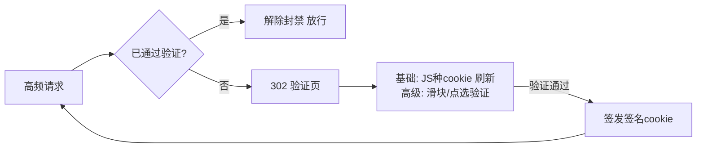

# 人机验证（Challenge）接入说明

WAF 在 **CC 超限** 且请求**未通过验证**时，返回验证页（302 跳转）而非直接拦截，
通过验证后自动解除封禁放行。

## 工作模式（`config.lua` → `_M.challenge.mode`）

| mode | 说明 | 依赖 |
|---|---|---|
| `basic` | 基础 JS Challenge：服务端签名 token，前端执行 JS 种 cookie 后自动刷新 | 无（自包含，默认） |
| `geetest` | 极验验证码（GT4 四代） | 需极验账号（captcha_id/key） |
| `gitee` | Gitee 验证码（与极验 GT4 协议兼容） | 需 Gitee 验证码服务账号 |

## 配置示例

```lua
_M.challenge = {
    enabled       = true,
    mode          = "basic",   -- basic | geetest | gitee
    cookie_name   = "waf_pass",
    cookie_secret = "请修改为随机长字符串",  -- 生产环境务必修改
    cookie_ttl    = 300,       -- 通过验证后的放行时长（秒）
    page_path     = "/__waf_challenge__",
    verify_path   = "/__waf_challenge_verify__",
    captcha = {
        id         = "",       -- 极验/Gitee captcha_id
        key        = "",       -- captcha_key
        verify_api = "https://gcaptcha4.geetest.com/validate",
        sdk        = "https://static.geetest.com/v4/gt4.js",
    },
},
```

## 接入 Gitee / 极验验证码（高级模式）

1. 在 Gitee 验证码 / 极验开放平台创建应用，获取 `captcha_id` 与 `captcha_key`。
2. 修改 `config.lua`：
   - `mode = "gitee"`（或 `"geetest"`）
   - 填入 `captcha.id`、`captcha.key`
   - 若使用 Gitee 独立接入点，将 `verify_api` 指向 Gitee 提供的验证接口
3. 校验协议（GT4 兼容）：
   - 前端完成验证后回传 `lot_number / captcha_output / pass_token / gen_time`
   - WAF 以 `sign_token = md5(captcha_key + lot_number)` 调 `verify_api`
   - 返回 `result == "success"` 则签发放行 cookie
4. **HTTP 客户端依赖**：
   - 验证接口为 HTTPS 时需安装 `lua-resty-http`（`opm get ledgetech/lua-resty-http`）
   - 未安装时自动回退到手动 cosocket，**仅支持 http:// 明文**接口

## 验证流程



- **basic 模式**：token 由服务端 `md5(secret:ip:ts)` 签名，不暴露密钥；
  无 JS 能力的 Bot 无法种 cookie，无法通过。
- **cookie 校验**：签名 + 有效期双重校验，防伪造与重放（过期即失效）。

## 测试（basic 模式）

```bash
# 触发 CC（临时把 config.lua 的 cc.rate 调低，如 "5/60"）
for i in 1 2 3 4 5; do curl -s -o /dev/null http://HOST:8086/?x=$i; done
# 第 5 次应 302 到挑战页
curl -s -o /dev/null -w "%{http_code} %{redirect_url}\n" http://HOST:8086/?x=6
# 挑战页返回含签名 cookie 的 HTML
curl -s http://HOST:8086/__waf_challenge__ | grep "document.cookie"
# 带正确签名 cookie（用 cookie_secret + 客户端 IP + 时间戳计算）→ 放行
```
