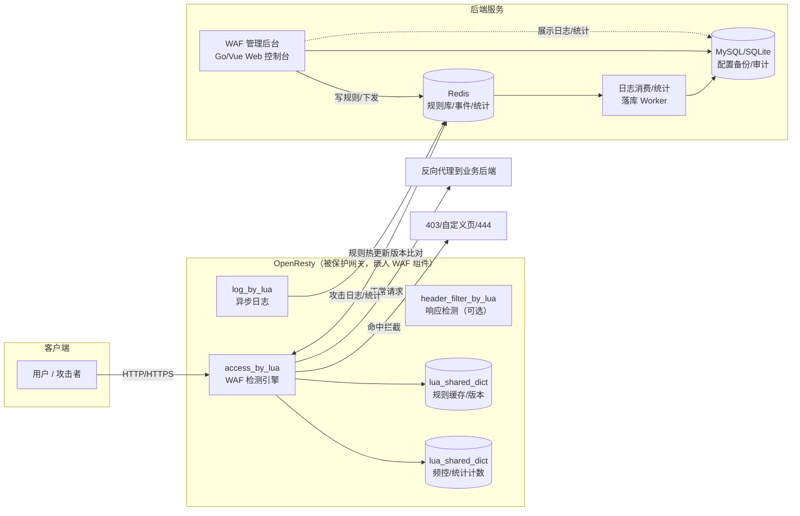
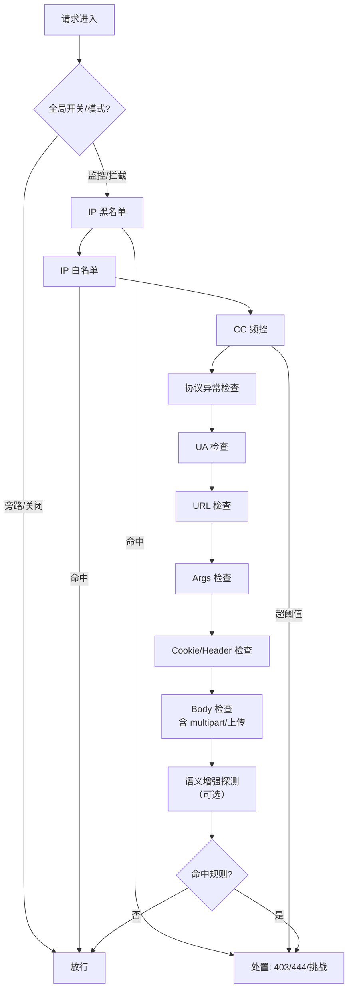

# 一个适配于 OpenResty 的 WAF — 项目计划

## 0. 调研结论：GitHub 同类产品

### 0.1 同类产品一览

| 项目 | Star(约) | 技术架构 | Web 后台 | 规则形式 | 维护状态 | 与本项目关系 |
|---|---|---|---|---|---|---|
| 长亭 **雷池 SafeLine** | ~19.8k | Nginx + 语义分析引擎(Go/Rust) | 有(控制台**未开源**) | 语义引擎+插件，无规则库 | **活跃** | 社区事实标准，但是"独立反向代理设备"，不可嵌入自有 OpenResty |
| **VeryNginx** | ~5.9k | OpenResty + Lua | **有**(Vue 控制台) | Matcher+Action 规则 | 停滞(~2016) | **形态最接近**：控制台+WAF+频控+浏览器验证+统计；规则库多年不更新 |
| **ngx_lua_waf** | ~5.9k | OpenResty + Lua | 无 | 纯文本正则规则文件 | 停滞(多年未更新) | 经典轻量，接入方式与 CC 防护可借鉴；无后台、规则靠 crontab 更新 |
| **lua-resty-waf** | ~0.9k | OpenResty + Lua | 无 | JSON ruleset(模拟 ModSecurity CRS) | 停滞(~2018) | 引擎设计优秀：phase 模型、规则跳转/链、异常打分、CRS 转换器，**可借鉴** |
| **openstar** | ~1.9k | OpenResty + Lua | 有 | 规则组(支持 or 连接符) | 停滞 | 增强型 WAF，带管理界面 |
| **x-waf** | ~1k | OpenResty + Lua + Go 后台 | 有 | 后台配置下发 | 停滞 | 面向中小企业，后台二进制部署 |
| **锦衣盾 JXWAF** | ~0.97k | OpenResty + Lua + 机器学习/语义 | 有 | 语义+规则 | 缓慢(转商业 AI WAF) | 商业化了 |
| **NAXSI** | ~5k | Nginx C 模块 | 无 | 白名单式规则 | 缓慢 | 仅 SQLi/XSS(libinjection)，无控制台 |
| **ModSecurity + OWASP CRS** | ~9.7k / ~3.2k | C 模块 | 无 | SecRules | **活跃** | 行业标准、规则库最全；非 Lua、接入成本高，可作**规则导入源** |
| **Coraza** | ~2.5k | Go | 无 | ModSecurity 兼容 | 活跃 | 非 OpenResty 生态 |

### 0.2 结论与差异化空间

1. **市场空白点**：OpenResty+Lua 生态中，"**活跃维护 + 规则热更新 + 自带 Web 管理后台 + 可嵌入任意 OpenResty**"的产品组合**不存在**。带后台的(VeryNginx/openstar/x-waf)全部年久失修；活跃的(雷池)是独立部署的一体化设备且控制台闭源，无法嵌入已有 OpenResty 网关。
2. **可借鉴的经验**：
   - `ngx_lua_waf`：`access_by_lua` 接入方式、规则文件组织、基于 `lua_shared_dict` 的 CC 防护。
   - `lua-resty-waf`：phase(access/header_filter/body_filter/log) 模型、规则 offset 预计算与链、异常打分、`modsec2lua-resty-waf` CRS 转换工具。
   - `VeryNginx`：控制台交互模型(Matcher+Action)、频控、浏览器验证、访问统计、config.json 动态生效。
   - `雷池`：容器化部署、站点管理、事件检索/一键处置、告警等后台产品化经验。
3. **立项价值**：做一个"**嵌入式 WAF Lua 组件 + 独立管理后台 + Redis 规则热下发**"，挂载到任意 OpenResty 即可获得完整 WAF 能力。

---

## 1. 项目定位

- **形态**：嵌入式 Lua 组件（挂载到任意 OpenResty 的 `access_by_lua` / `header_filter_by_lua` / `log_by_lua` 阶段）+ 独立 Web 管理后台 + 规则热下发通道。
- **核心能力**：自动检测 → 拦截/放行/人机验证 → 全量记录；后台可视化管理规则。
- **目标用户**：中小团队、独立开发者、已有 OpenResty 网关/API 网关想低成本叠加安全能力的团队。
- **一句话**：*"给任意 OpenResty 装上带后台的 WAF"*。

---

## 2. 需求分析

### 2.1 功能性需求（WAF 核心）

- **基础检测**：SQL 注入、XSS、命令/代码执行、LFI/RFI、路径穿越、SSRF、文件上传（后缀+内容）、恶意 UA/扫描器、HTTP 协议异常、敏感文件泄露（`.git`/`.svn`/备份/日志）。
- **访问控制**：IP / UA / Cookie / Header / URL / Args 的黑白名单，支持 CIDR；可选地域封禁。
- **限流防 CC**：单 IP 频率、URI 频率、令牌桶；支持分级处置（拦截 / 延迟 / 人机验证）。
- **人机验证**：JS Challenge / Cookie 校验（借鉴 VeryNginx `browser_verify`）。
- **工作模式**：监控模式（仅记录不拦截）/ 拦截模式 / 放行模式，可全局一键切换。
- **请求上下文**：multipart 表单解析、URL 解码、多重编码探测、body 大小上限。
- **日志与统计**：攻击日志（命中规则、payload、IP、UA、时间、站点）；访问统计（按 URI/IP/状态码聚合）。

### 2.2 功能性需求（管理后台）

- **仪表盘**：请求量、拦截量、攻击类型分布、TOP IP / TOP URL 图表。
- **规则管理**：规则 CRUD、启停、排序、分组（SQLi/XSS/RCE…）、导入导出（JSON / ModSecurity CRS）。
- **规则调试**：在线用样例 payload 测试规则命中（借鉴 VeryNginx `test_match`）。
- **名单管理**：IP / UA 黑白名单。
- **防护配置**：CC 阈值、拦截响应（状态码+自定义页面）、工作模式、全局开关。
- **站点管理**：多站点/多域配置，规则按站点隔离（一个网关保护多业务）。
- **日志查询**：攻击事件检索、详情、**一键加白/加黑**。
- **系统**：管理员账号、TOTP 二次验证、操作审计、告警（钉钉/企业微信/邮件，可选）。

### 2.3 非功能性需求

- **性能**：全规则检测单请求延迟目标 **< 1ms**（参考：lua-resty-waf 全规则集约 300–500µs）。
- **可用性**：检测异常时 **fail-open**（放行并记录，绝不影响业务）；全局旁路开关。
- **可移植性**：仅依赖 LuaJIT 2.1 标准库 + 常见纯 Lua `lua-resty-*` 库，**无需重新编译 Nginx**，适配 OpenResty ≥ 1.15。
- **安全**：管理后台独立端口/独立 server，限 IP 访问，强认证 + TOTP + 防爆破 + 敏感操作审计。

---

## 3. 总体架构



**关键数据流（规则热更新链路，无需 reload）：**

1. 管理后台写入/修改规则 → Redis（JSON ruleset + 全局 `version` 自增）。
2. 各 worker 内共享内存缓存规则；每次请求（或定时/订阅）比对版本号，变化则原子切换加载新规则集。
3. `access_by_lua` 阶段执行检测，命中按动作处置。
4. `log_by_lua` 阶段异步写攻击日志与统计计数（不阻塞请求）。
5. 后台从 Redis/落库数据读取展示，支持事件"一键加黑/加白"（写回规则库立即生效）。

---

## 4. 模块设计

### 4.1 WAF 引擎（Lua 侧）目录结构

```
waf/
├── init.lua                # 加载配置/内置规则/初始化共享内存
├── access.lua              # access_by_lua 入口（检测编排）
├── header_filter.lua       # header_filter_by_lua 入口（响应检测，可选）
├── log.lua                 # log_by_lua 入口（异步日志/统计）
├── config.lua              # 全局配置（模式、阈值、依赖开关）
├── rule_engine/
│   ├── engine.lua          # 规则执行器（phase/offset 跳转/链）
│   ├── operators.lua       # 运算符：REGEX/PM/EQUALS/CONTAINS/CIDR/STRREQ...
│   ├── variables.lua       # 变量集合：URI_ARGS/POST_ARGS/HEADERS/COOKIE/BODY/METHOD...
│   ├── transforms.lua      # 变换链：url_decode/lowercase/多重解码/去注释
│   └── actions.lua         # 动作：BLOCK/DROP/ACCEPT/REDIRECT/SCORE/CHALLENGE/RATELIMIT
├── detectors/
│   ├── sqli.lua  xss.lua  rce.lua  lfi.lua  ssrf.lua   # 内置检测
│   ├── protocol.lua        # 协议异常/畸形请求
│   ├── leak.lua            # 敏感文件/目录泄露
│   ├── cc.lua              # 频控（shared dict 令牌桶）
│   ├── challenge.lua       # 人机验证（JS/Cookie）
│   └── upload.lua          # 文件上传（后缀+内容头检测）
├── ip.lua   ua.lua   header.lua    # 名单/UA/Header 检查
├── storage.lua             # shared dict + Redis 读写封装
├── semisense.lua           # （可选）libinjection 风格 SQL/XSS 词法探测，降正则绕过
└── ruleset/                # 内置规则（JSON），按类别分文件
    ├── sqli.json  xss.json  rce.json  lfi.json  ...
    └── whitelist.json      # 默认白名单/例外
```

### 4.2 规则 DSL（JSON，借鉴 lua-resty-waf / ModSecurity）

```json
{
  "id": "20001",
  "group": "sqli",
  "phase": "access",
  "severity": 2,
  "enabled": true,
  "vars":   [{ "type": "URI_ARGS", "parse": ["values", true] }],
  "operator": "REGEX",
  "pattern": "(union[\\s]+select|select[\\s]+.*from)",
  "transforms": ["url_decode", "to_lowercase"],
  "actions": { "disrupt": "BLOCK", "status": 403,
               "msg": "SQL injection detected", "tag": "attack-sqli" }
}
```

- **phase**：`access`（请求检测）/ `header_filter`（响应头）/ `body_filter`（响应体，可选）。
- **变量**：`URI_ARGS`、`POST_ARGS`、`HEADERS`、`COOKIE`、`BODY`、`METHOD`、`REQUEST_LINE` 等，支持 `specific` 参数与负向排除。
- **运算符**：`REGEX`（PCRE JIT）、`PM`（词组）、`EQUALS`、`CONTAINS`、`CIDR`、`STRREQ`、`EXISTS`。
- **变换链**：`url_decode` → `to_lowercase` → 多重解码，模拟真实解码场景。
- **高级特性**：规则链（`chain`）、规则跳转（`skip` / `skip_after`）、规则例外（`ignore_rule` / 白名单规则）、异常打分（`SCORE` + 阈值）。
- **CRS 导入**：内置 `modsec → 本 DSL` 转换器（参考 lua-resty-waf `modsec2lua-resty-waf.pl`），可一键导入 OWASP CRS 子集。

### 4.3 检测流水线（access 阶段）



- 每一步都支持"仅记录"（监控模式），命中即写攻击日志。
- 白名单优先于黑名单与规则检测，避免误伤。

### 4.4 管理后台设计

- **技术栈（已确认）**：
  - 后端：**Go + Gin + GORM**。
    - Gin：RESTful API 框架（路由、中间件、参数绑定与校验、JWT 鉴权、CORS）。
    - GORM：ORM 数据层，管理规则/站点/名单/事件/审计等表模型；MySQL（生产）/ SQLite（单机与演示）。
    - Redis：实时规则下发、攻击事件缓冲、统计聚合（Lua 引擎侧直接读写 Redis，GORM 不参与实时链路）。
    - 编译为单一二进制并 `embed` 前端静态资源，部署简单（参考 x-waf）。
  - 前端：**Vue3 + Vite + TypeScript + shadcn/vue**。
    - shadcn/vue：基于 Tailwind CSS + Radix Vue / Reka UI 的无头组件（按钮、表格、Dialog、Dropdown、Toast、Form、Tabs 等），组件源码拷入项目内自由定制，Token 化主题、支持暗色模式，适合仪表盘/规则管理类工具界面。
    - 配套：Pinia（状态）、Vue Router、ECharts（图表）、TanStack Table（可选，攻击事件大数据表格）。
  - 后台自身独立端口 / 独立 server block，不与业务同域。
- **核心页面**：
  - 仪表盘（ECharts：请求/拦截趋势、攻击类型分布、TOP IP/URL）。
  - 攻击事件（检索、详情、一键加黑/加白）。
  - 规则管理（分组树、启停、上下移、导入导出、**在线调试**）。
  - 名单管理 / CC 防护 / 站点管理 / 告警配置 / 系统设置（账号、TOTP、审计）。

### 4.5 数据存储

| 数据 | 方案 |
|---|---|
| 规则配置（实时） | Redis（JSON + version）；后台 DB 做持久化备份与审计 |
| 攻击日志 | 起步：`log_by_lua` 写本地文件 + 后台定时解析入库；进阶：批量写 Redis/Kafka → 消费落库（MySQL/Loki/ES） |
| 访问统计 | worker 内 shared dict 聚合 → 定时（~10s）刷 Redis/DB |

---

## 5. 接入与部署

### 5.1 嵌入式接入（主要方式，适配任意 OpenResty）

在现有 `nginx.conf` 的 `http` 段增加：

```nginx
lua_package_path "/opt/waf/?.lua;;";
lua_shared_dict waf_rule    20m;   # 规则缓存/版本
lua_shared_dict waf_counter 50m;   # 频控/统计计数
init_by_lua_file   /opt/waf/init.lua;
access_by_lua_file /opt/waf/access.lua;
log_by_lua_file    /opt/waf/log.lua;
```

- 纯 Lua 实现，仅依赖 `lua-resty-core` / `lua-resty-lock` / `lua-resty-redis` 等常见纯 Lua 库，**无需重新编译 Nginx**，对任意 OpenResty 版本即插即用。

### 5.2 独立网关模式（可选）

- Docker Compose 一键部署 OpenResty + WAF 组件 + 管理后台，作为业务前置反向代理（接入体验参考雷池，但完全开源、控制台自研）。

### 5.3 规则接入来源

1. 内置规则集：SQLi / XSS / RCE / LFI / SSRF / 扫描器 / 恶意 UA / 协议异常 / 敏感文件（参考 ngx_lua_waf 规则与 OWASP CRS 子集）。
2. 一键导入 OWASP CRS（ModSecurity 格式，经内置转换器）。
3. 自定义 / 社区规则导入导出（JSON）。

---

## 6. 性能与安全设计

- **性能**：
  - 正则统一走 `ngx.re.*`（PCRE JIT），规则启动时预编译并预计算 offset 跳转（参考 lua-resty-waf）。
  - `lua_shared_dict` 计数用 `incr + expire`，避免跨 worker 竞争。
  - 日志在 `log_by_lua` 后置阶段异步处理；高频场景用批量/`lua-resty-logger-socket`。
  - body 大小上限、multipart 深度限制，防资源耗尽。
- **安全**：
  - 检测失败 **fail-open**；全局一键进入监控/旁路。
  - 管理后台独立监听 + 限 IP + 登录失败锁定 + **TOTP** + 敏感操作审计日志。
  - 规则热更新原子切换（版本号 + 新旧规则不混用），杜绝配置中间态。

---

## 7. 里程碑

| 阶段 | 内容 | 周期 |
|---|---|---|
| **M0 调研与原型** | 验证 Lua 引擎在各阶段挂载、Redis 规则热更链路可行性 | 1 周 |
| **M1 核心引擎** | 规则 DSL、运算符/变量/变换、内置规则集（SQLi/XSS/RCE/LFI/UA/协议异常）、监控/拦截模式、攻击日志 | 3 周 |
| **M2 进阶防护** | CC 频控、人机验证、multipart/上传检测、响应阶段检测、异常打分 | 2 周 |
| **M3 管理后台** | 仪表盘、规则管理（含在线调试、导入导出）、名单管理、日志查询、站点管理、认证(TOTP) | 4 周 |
| **M4 工程化** | 规则热更新一致性、性能压测与调优（全规则 <1ms）、Docker 部署、文档与示例 | 2 周 |
| **M5 打磨** | CRS 导入完善、告警集成、多实例、自动化测试（Test::Nginx::Socket::Lua 风格） | 持续 |

---

## 8. 风险与对策

| 风险 | 对策 |
|---|---|
| 规则误报影响业务 | 监控模式先行；规则分组可整组关闭；在线调试；异常打分阈值机制 |
| 规则热更一致性 | 版本号 + 原子切换；发布失败自动回滚上一版本 |
| 检测拖慢请求 | fail-open + 旁路开关 + 性能压测门槛（<1ms） |
| 后台自身被攻击 | 独立端口 + 限 IP + TOTP + 审计 + 防爆破 |
| 规则库维护成本 | 内置规则 + CRS 一键导入 + 社区规则格式标准化 |

---

## 10. 企业级进阶（2026-08 已落地）

在 M0-M5 基础上向企业级方向补齐，已实现的增强：

### 检测能力深度
- 解码器栈扩展：base64 / hex / HTML 实体解码（带"疑似编码"护栏），组合解码链抗绕过。
- JSON 嵌套解析深度限制 + 纯 Lua 轻量 XML 解析（标签/属性/文本展平，XXE 特征保留）。
- HPP 参数污染变量（URI_ARGS_DUP / POST_ARGS_DUP）+ 参数/请求头计数变量（ARGS_COUNT / HEADERS_COUNT）。
- CIDR 运算符支持 IPv6（:: 压缩与 IPv4 尾段映射，纯 Lua 128 位逐字比较）。
- 超大上传落盘流式检测：body 超 client_body_buffer_size 落临时文件时读取前缀 `spooled_scan_bytes`（默认 512KB）继续后缀/类型检测，堵住绕过。
- API 安全规则组（敏感端点/GraphQL 内省/XXE）+ 编码混淆规则（base64 载荷）。
- DLP 响应检测规则组（身份证/银行卡/手机号/私钥/云密钥，默认 LOG_ONLY），响应体缓冲上限可配置。
- 慢速攻击双层防护：接入模板下发超时/缓冲参数 + 加固文档（docs/hardening.md）。

### 引擎可靠性
- 热更新版本单调性校验（数字版本、拒绝回退/非法版本）+ 规则集结构校验（坏规则集拒载，保持当前集）。
- 发布历史快照（Redis EVAL 原子下发+版本自增）+ 后台一键回滚 + 前端发布历史弹窗。
- shared dict 写满降级告警（CC 封禁写失败仍拦截）、配置广播重试、热更写失败自动重试。
- access 全流程 fail-open 总闸（外层 pcall + _exited 区分正常拦截）+ 检测 watchdog 超时强制放行。
- 规则运算符白名单 + pattern 长度护栏（32KB）+ 引擎侧超长正则防御性跳过。
- 引擎版本常量随事件/触发记录上报，后台配置页展示版本健康信息。

### Bot 管理
- basic 人机验证改为 JS 工作量证明（FNV-1a 前导零，双侧同算法），无 JS 的 bot 跟随重定向也拿不到放行 cookie。
- 爬虫/客户端指纹规则组（搜索引擎爬虫/客户端库/监控探针，默认 LOG_ONLY）+ 触发规则新增 block 直接拦截类型，形成 豁免/挑战/限流/拦截 四级策略。
- CC 限流支持 UA 维度（各 UA 独立计数桶）与无 Cookie 维度计数。
- 挑战页同 IP 签发限频（默认 20 次/60s，超限 444 拒绝渲染）。

### 明确不做的方向（决策记录）
- 多实例集群一致性（Redis 集中计数 / pub/sub 推送 / 多引擎节点管理）：用户定位为单实例部署。
- JA3/JA4 指纹：需第三方 C 库，违背"纯 Lua、零重编译"约束，以被动指纹（UA/客户端库/触发规则）替代。
- 阶段四（RBAC/审计/告警/数据保留）与阶段五（Prometheus/集成测试/压测进 CI）后续再做。

## 9. 参考项目清单

- 长亭雷池 SafeLine：https://github.com/chaitin/safeline
- loveshell/ngx_lua_waf：https://github.com/loveshell/ngx_lua_waf
- alexazhou/VeryNginx：https://github.com/alexazhou/VeryNginx
- p0pr0ck5/lua-resty-waf：https://github.com/p0pr0ck5/lua-resty-waf
- starjun/openstar：https://github.com/starjun/openstar
- xsec-lab/x-waf：https://github.com/xsec-lab/x-waf
- OWASP CRS：https://github.com/coreruleset/coreruleset
- ModSecurity：https://github.com/owasp-modsecurity/ModSecurity
- NAXSI：https://github.com/nbs-system/naxsi
- Awesome-WAF 列表：https://github.com/0xInfection/Awesome-WAF